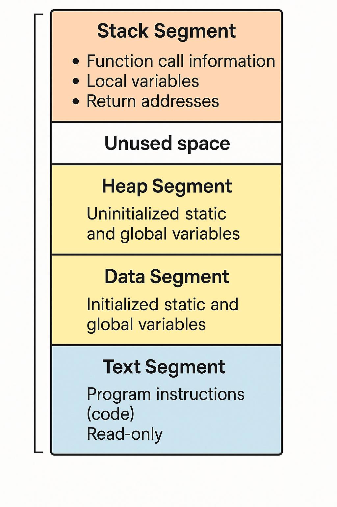
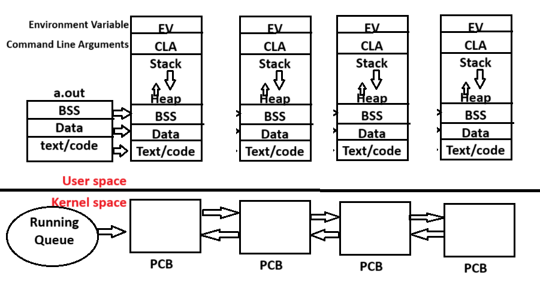

# Program Management Subsystem

The Program Management Subsystem is responsible for loading, executing, and managing programs (processes) in memory. It deals with how programs become processes and how they interact with the OS.

1. Process creation and deletion.
2. Sending and raising the process.
3. Mechanism for communication between multiple process.
4. Provides mechanism for synchronization between process.<br>

```
    compilation (gcc)   ->  Executable file (a.out) or Binary file
```

- a.out file is stored in Hard Disk, when it is executed it gets loaded into RAM. The memory segments gets loaded into the User space and the PCB of the program or process gets loaded into the Kernel space.

- RAM is divided into two parts.

1. User space
2. Kernel space


#### What is Memory segments of a program?

#### What is Memory sectioin of a program?

#### Memory Layout of a program?

Memory segments of a program refer to the distinct sections of memory allocated during program execution—namely the Text, Data, BSS, Heap, and Stack segments, each serving a specific role such as storing code, variables, or managing function calls and dynamic memory.



- Stack and Heap are created only when program gets loaded to userspace of RAM.
- Memory created using DMA calls is stored in Heap. <br>

#### Stack Memory :

- When a funtion is invoked a block of memory is created in stack is called Stack Memory.

#### Stack Area :

- When a new Thread is created a block of memory is created in stack is called Stack Area.

#### PCB

- For every process, the operating system creates a block of memory in kernel space called the Process Control Block (PCB).

### PCB contains

1. Process Identifier (PID)
2. Parent Process Identifier (PPID)
   - Every process is created from another process. That another process is called Parent Process.
3. File Descriptor table (FD table)
   - It contains the information of the files that are being opened by the programmer. There are many files in kernel but it does not maintain all the info these files.
4. Signal Disposition Table / Signal Behaviour Table / Disposition of Signal
   - refers to a data structure that maintains how a process handles various signals.
   - Every process in an OS (especially Unix-like systems) can receive signals — asynchronous notifications sent to a process to notify it of events (e.g., SIGINT, SIGTERM, SIGKILL, etc.).
   - When we are hanging in infinite loop, then we press the key to come out of the loop
     - ctrl + c -> Terminate
     - ctrl + z -> Suspend
     - These combination when used in kernel space generate the signal.
   - Improper handling of pointers causes crash during runtime of execution and program crashes with segmentation fualt. Then this process is aborted using signaling mechanism.
5. Page Table
   - In operating systems that use virtual memory, a page table is a data structure used to map virtual addresses (used by a process) to physical addresses (actual locations in RAM).
   - While the page table itself is not literally part of the Process Control Block (PCB), the PCB holds a reference (or pointer) to the page table of the process.

## Process

- A process consists of memory segments in userspace and PCB in kernel space, which together represent the complete exectution environment of a program.

- Process = memory segment in userspace + kernel space PCB
- There are so many process in the system. They have their own memory segment and corresponding PCB in kernel space.
  <br>


<br>

## Running Queue

- PCB are maintained as a node in linked list and the list is called the Running Queue.
